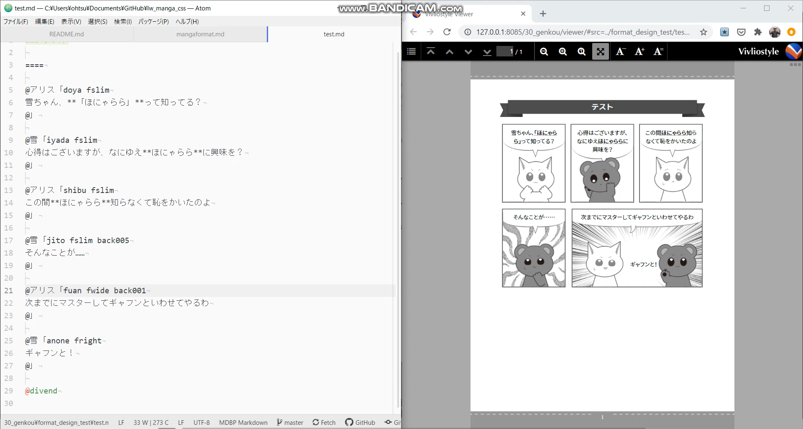

# lw_manga_css～Vivliostyle用マンガスタイルCSS

## 概要
リブロワークスが制作した『[そろそろ常識？ マンガでわかる「正規表現」](https://libroworks.co.jp/?p=3271)』から、原稿とイラストを除き、CSSとダミー原稿をまとめたものです。イラストはリブロワークス社内で作成したものに差し替えているので、CSSと同じライセンスの下で使用できます。

[Vivliostyle](https://vivliostyle.org/ja/)を利用して、印刷可能なPDFを作成することができます。



出力結果については、「40_pdf/fullpage_sample.pdf」をご覧ください。

## とりあえず見る方法
1. ローカルにCloneして個々のHTMLをwebブラウザで開く。ページングはされないがとりあえず見ることができます。
2. ローカルでWebサーバーを立ち上げてルートにファイルを配置し、「`http://localhost/30_genkou/viewer/#src=../00_maeduke.html&bookMode=true`」のような指定で開く。
3. 当社製のAtomエディタ用パッケージ[MDBP](https://atom.io/packages/mdbp-markdown-book-preview)で、00_maeduke.mdを開く。
4. レンダリング後のPDFが「40_pdf/fullpage_sample.pdf」です。


## CSSについて
CSSは「30_genkou/_css」フォルダに収録されています。ページ設定にはCSS Paged Meidaを使用しています。

|CSSファイル | 役割
|--|--
|1_main.css  |h1～h6やpなど、標準的なタグ用のスタイルを定義。必須
|2_kaiwa.css |会話表現用のスタイルを定義。必須
|3_manga.css |マンガ表現用のスタイルを定義。必須
|00_maeduke.css |目次、前書きなどの前付けのスタイルを定義
|chap1.css～chap6.css |1～6章のツメのスタイルを定義
|chap7_appendix.css |付録章のスタイルを定義
|99_atodule.css  |索引、プロフィールなどのスタイルを定義
|999_okuduke.css |奥付のスタイルの定義

### 画像ファイル
このCSSでは、background-imageによる画像ファイルでデザインを設定しています。**画像ファイルを置き換えることで、デザインを変える**ことができます。画像ファイルは「30_genkou/_css/img」に収録されています。

|画像ファイル | 用途
|--|--
|manga_charaフォルダ | マンガ用のキャラクター画像
|manga_backフォルダ |コマの背景画像
|kaiwa_faceフォルダ | 会話用のキャラクター画像（マンガ用画像を左右反転して使用）
|3frame_fukidashi_c/l/r.svg |吹き出しのしっぽ
|chara_mame.png | マメ知識用画像
|comic_regex_bg2.png | 本文の背景画像
|comic_regex_circle01.png |キャラクター紹介の背景画像
|comic_regex_h3_bg.svg |h3見出しの背景画像
|comic_regex_lace01.svg |セクションタイトル（h2見出し）の背景画像
|comic_regex_mae_h2_bg.svg |前付けの見出しの背景画像
|comic_regex_mae_mokuji01.svg |目次の見出し背景画像
|comic_regex_mae_mokuji02.svg |目次の見出し背景画像
|comic_regex_tobira_bg.png |章扉の背景画像
|plate_icon.svg |黒板用のアイコン
|soro_seiki_soutobira.png |総扉の背景画像

※装飾部分はなるべくSVG画像を使用していますが、サイズが大きいと粗くレンダリングされる現象があるため、一部はPNG画像にしています。


## HTML構成について
複数のHTMLで構成されており、VivliostyleのbookModeで連結しています。00_maeduke.html内の目次（nav要素）内でリンクされたファイルが、自動的に読み込まれます。

999_okuduke.html以外は同名のMarkdownファイルから変換したものです。

|HTMLファイル |用途
|--|--
|00_maeduke.html |前付け（前書き、目次、キャラクター紹介）
|chap1/chap1.html～chap6/chap6.html | 1章～6章
|chap7/chap7_appendix.html | 付録
|99_atoduke.html |後付け（索引、ファイル案内、プロフィール）
|999_okuduke.html |奥付


## Markdownからの変換について
現状、MarkdownからHTMLへの変換にはAtomエディタ用のMDBPプラグインが必要です。

https://atom.io/packages/mdbp-markdown-book-preview

AtomエディタにMDBPをインストールした後、「フォルダを開く」機能でローカルリポジトリを開き、Markdownファイルのどれかを開いて右クリックし、「MDBP→Start Live Server」、「MDBP→Open Vivliostyle Preview」を選択します。

### Markdown内の書式指定ルールについて
ルールについては以下のファイルにまとめています（更新中）。

30_genkou/format_desing_test/mangaformat.md


### Markdown変換の要件
Markdown変換のためにMDBP以外の変換ツールを使ってもよいのですが、以下の機能が必要になります。

- _postReplace.jsonの置換リストに基づいた置換処理。<br>
原稿として書きやすい表記、本ごとの独自指定のために使用しています。
- svgimgによるトリミング処理<br>
あまり評判がよくない機能ですが、細かい画面ショットのサイズ・位置調整に必要です。
- Markdownファイルと同名のCSSを読み込む機能
- 見出しにIDを振る（目次に必要）
- Highlight.jsを使ったソースコードの色分け<br>
色分けはめったにしませんが、コメント部分を目立つように加工するワザが使えます。


## WordPress用CSSについて
「3_frame_wp.css」はWebページ向けに軽くカスタマイズしたものです（印刷用のCSSを簡単な調整でWeb向けにしているので、無駄な記述が多めかもしれません）。

WordPressで使う場合は、WPフォルダ内のどこかに3_frame_wp.css、manga_charaフォルダ、manga_backフォルダ、3frame_fukidashi_c/l/r.svgをアップロードし、「Code Snippets」などのfunction.phpを編集するプラグインを使ってCSSファイルを読み込みます。

```
wp_enqueue_style( 'manga-css', 'https://www.libroworks.co.jp/manga_css/3_frame_wp.css' );
```
